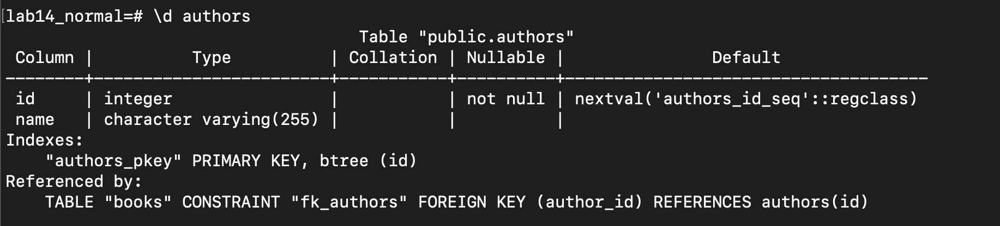
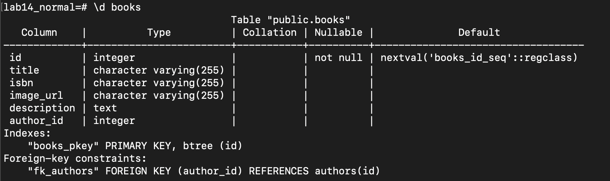

# Database Normalization

## Database Setup
- "lab14" Table
First, I will go inside the repo folder and at the terminal, I will create a new database for the project which is called "lab14" which has only books table.

```
pasql
CREATE DATABASE lab14;
```
Then, I quite the psql shell and type the following command to connect the database to the sql files that I have it inside the repo.

```
\q
psql -f data/schema.sql -d lab14
```
Therefore, I will restart psql again, and try to connect to the database and select all of the rows to make sure that we are working exactly what the progress wants.

```
psql lab14
SELECT COUNT(*) FROM books;
```
***It must show us a 12 rows.***
Also, we run the repo locahost to check that all the codes inside the repo is working perfectly and it takes the data from the lab14 database.


- "lab14_normal" Table
First, we restart the psql shell and type the following command that will create a new database and migrate all of the queries from the "lab14" database into the new one "lab13_normal" by the following scripts in the terminal.

```
psql
CREATE DATABASE lab14_normal WITH TEMPLATE lab14;
\c lab14_normal
SELECT COUNT(*) FROM books;
```
***Now, it must also show a 12 rows.***

## Database Migration
1. Lets apply the normalization for the second database "lab14_normal". First, we have to create a new table called authors which has two columns, which are id and author's name.
```
CREATE TABLE AUTHORS (id SERIAL PRIMARY KEY, name VARCHAR(255));
```

2. Now, we have two tables, each one has certain purpose and that what normalization exactly meant to be. Therefore, let start with migrating the values of author names from table "books" into table "authors".
```
INSERT INTO authors(name) SELECT DISTINCT author FROM books;
```

3. Lets add a column to the "books" table called author_id and it should be integer data type.
```
ALTER TABLE books ADD COLUMN author_id INT;
```

4. Now, we will fill out the authro_id column inside the "books" table from the id column inside the "authors" table by making a connection between them.
```
UPDATE books SET author_id=author.id FROM (SELECT * FROM authors) AS author WHERE books.author = author.name;
```
***it will give a message "UPDATE 12"***

5. Drop the column of the unnecessary author name from the table "books".
```
ALTER TABLE books DROP COLUMN author;
```

6. Lastly, set the author_id column in the "books" table as a foreign key (reference) to the id column in the "books" table.
```
ALTER TABLE books ADD CONSTRAINT fk_authors FOREIGN KEY (author_id) REFERENCES authors(id);
```

***Here, how the books and authors ahould looks in the terminal.***


